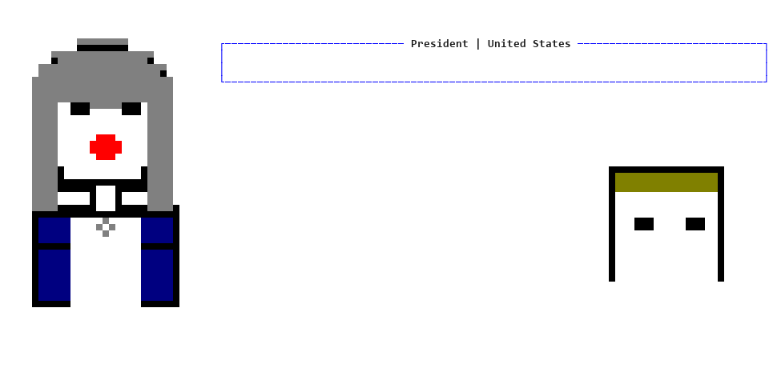
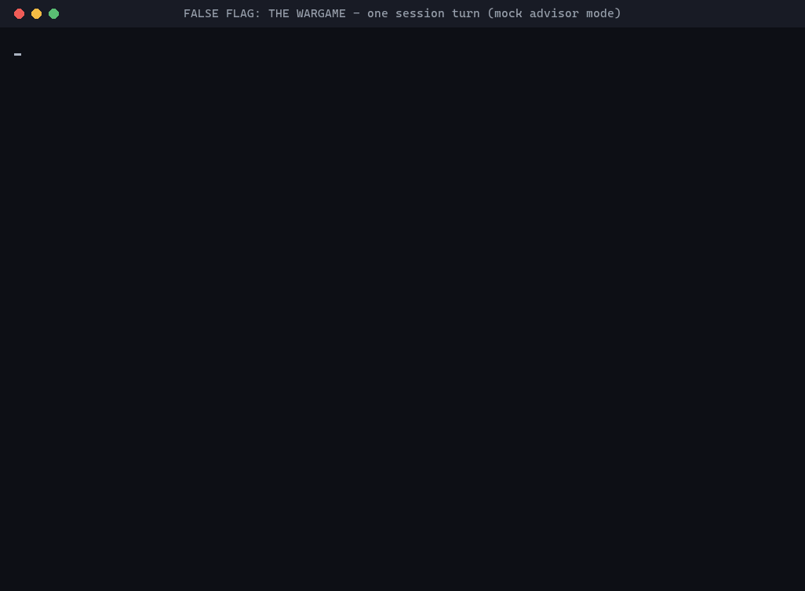

# FALSE FLAG: THE WARGAME

You are the UK Prime Minister. Russia has just staged an attack and blamed Britain for it. Your cabinet of AI advisors is waiting for you to decide what happens next — in your own words, not from a menu.

> Inspired by Sky News' **[The Wargame](https://www.audible.co.uk/podcast/The-Wargame/B0FCLQ7W9B)** podcast. This is an independent project — not affiliated with or endorsed by Sky News, Tortoise, or the podcast's participants.



## What Happens in a Session

- **Briefing** — you're read into the crisis: intelligence updates, breaking developments, and sometimes a call from a foreign leader you have to take there and then.
- **Cabinet discussion** — you question five AI advisors (military, intelligence, diplomatic, legal, domestic) in plain English, and they answer in character.
- **Free-form decision** — you say, in your own words, what you want to do. There is no list to choose from.
- **Adjudication** — the game interprets your decision, your advisors push back if it's reckless, and the outcome plays out.
- **Consequences** — escalation risk, alliance cohesion, and domestic stability shift, the world state updates, and it carries into the next turn.
- Play this out across a live, unscripted crisis with seven nations in the mix, until the UK faces the threat down, stumbles into war, or looks weak in front of an adversary testing NATO's resolve.

Here's a full first turn, start to finish:



## Features

- **Free-form Decision Making**: Describe any action you want to take - the game interprets and adjudicates it
- **AI-Powered Advisors**: Ask questions and get intelligent responses from your Cabinet (CDS, NSA, Foreign Secretary, Home Secretary, Attorney General)
- **Dynamic Scenario Generation**: Events unfold based on your decisions and the evolving crisis
- **Realistic Constraints**: Limited military capabilities, alliance politics, legal frameworks, and public opinion
- **Two-Phase Turns**: Discussion phase (ask questions, gather advice) and Decision phase (commit to action)
- **Save/Load System**: Continue your campaign across multiple sessions

## Quickstart

**Windows (PowerShell):**

```powershell
git clone https://github.com/earlyprototype/false-flag.git
cd false-flag

python -m venv .venv
.\.venv\Scripts\pip.exe install -r requirements.txt

# Avoids a console-encoding crash some Windows terminals hit on the box-drawing UI
$env:PYTHONIOENCODING = "utf-8"

.\.venv\Scripts\python.exe -m cli.main play
```

**Linux / macOS:**

```bash
git clone https://github.com/earlyprototype/false-flag.git
cd false-flag

python3 -m venv .venv
.venv/bin/pip install -r requirements.txt

.venv/bin/python -m cli.main play
```

No API key and no config file needed. With nothing configured, the game defaults to a deterministic **mock** advisor mode, so you get the full turn structure — briefing, cabinet Q&A, decision, adjudication — without calling out to any LLM provider. On first launch you'll be asked to pick a scenario, play mode, difficulty, and game type; each menu has a sensible default, so pressing Enter through them is fine.

### Real AI advisors (recommended for actual play)

Mock mode proves the game runs, but it answers from a small set of canned advisor lines rather than reasoning about your specific decision. For the real experience:

1. Install the Gemini SDK: `.\.venv\Scripts\pip.exe install google-generativeai`
2. Get a free API key from [Google AI Studio](https://aistudio.google.com/apikey)
3. `copy config.example.py config.py`, then edit `config.py`:
   ```python
   GOOGLE_API_KEY = "AIza..."
   LLM_PROVIDER = "gemini"
   ```
4. Run the same launch command again.

See [docs/GEMINI_SETUP.md](docs/GEMINI_SETUP.md) for detailed setup instructions.

## How to Play

### Commands

During gameplay, you can use:

- **Ask Questions**: `CDS, what are our military options?`
- **Get Advice**: `NSA, what's Russia's likely next move?`
- **Check Status**: `/status` - View metrics and situation
- **View Menu**: `/menu` - See available advisors and commands
- **Intelligence**: `/intel` - Briefing on foreign actors
- **Diplomacy**: `/call <country>` - Phone a foreign leader
- **Make Decision**: `/decide` - Commit to your action
- **Save Game**: `/save` - Save progress
- **Quit**: `/quit` - Exit game

### Example Gameplay

```
> CDS, what are our air defence capabilities?

Military Commander: Prime Minister, we can maintain only two simultaneous 
combat air patrols across the entire UK. Our Type-45 destroyers provide 
ballistic missile defence, but we have limited coverage...

> Foreign Secretary, will NATO support us?

Diplomatic Lead: Prime Minister, the US commitment is uncertain. We must 
activate Article 4 consultations immediately and engage directly with 
Washington to secure their backing...

> /decide

Prime Minister, what is your decision?
> Deploy Type-45 destroyers to defensive positions and request emergency 
  NATO consultations under Article 4

[Decision interpreted and adjudicated...]
```

## Game Mechanics

### Metrics

Your decisions affect three key metrics (visible as numbers in Classic mode,
as narrative "vibes" in Immersive/Emergent modes), plus a casualty count:

- **Escalation Risk** (0-100): Danger of conflict escalation
- **Domestic Stability** (0-100): Public confidence and infrastructure security
- **Alliance Cohesion** (0-100): NATO unity and US commitment

In **Classic mode**, the crisis has win/lose thresholds: escalation hitting 100,
stability or cohesion collapsing to 0 ends the campaign, and surviving to the
end of the scenario produces a graded resolution. Immersive and Emergent modes
are open-ended by design — the story continues as long as you keep playing.

### Advisor Pushback

Your advisors will warn you if actions are:
- Militarily implausible (deploying unavailable assets)
- Legally problematic (violating international law)
- Diplomatically risky (fracturing NATO)
- Domestically dangerous (causing panic)

### Constraints

You must balance:
- Limited military capabilities (only 2 air patrols for entire UK)
- Uncertain US/NATO commitment
- Legal frameworks (international law, rules of engagement)
- Public messaging and domestic security
- Russian provocations and false flag operations

## Project Structure

```
false-flag/
├── cli/                    # Command-line interface (the playable game)
├── engine/                 # Core game engine
│   ├── sim_loop.py        # Turn-based game loop
│   ├── initial_conditions.py  # Scenario setup
│   └── persistence.py     # Save/load system
├── llm/                    # LLM integration
│   ├── router.py          # Provider selection
│   ├── gemini_driver.py   # Google Gemini integration
│   ├── mock_driver.py     # Testing/offline mode
│   └── prompts.py         # Prompt templates
├── agents/                 # Advisor system
│   └── conversation.py    # Question handling & responses
├── models/                 # Data models (game state)
├── data/scenarios/         # Scenario data (initial conditions + turn injects)
├── Game_Mechanics/         # Design notes for the game systems
├── tests/                  # Test suite
├── docs/                   # Documentation & setup guides
├── scripts/                # Launchers and setup helpers
├── dev-scripts/            # Debugging and content-generation tools
├── api/, frontend/         # Experimental web UI — not wired into the CLI game yet
├── Graphics/, UX/          # Visual asset generation & UX exploration (experimental)
└── ingestion/, overrides/  # Scenario-content tooling
```

## Development

### Run Tests

```powershell
.\.venv\Scripts\python.exe -m pytest tests/
```

### Run Linter

```powershell
.\.venv\Scripts\python.exe -m ruff check .
```

## Further Documentation

- **[GAME_DESCRIPTION.md](GAME_DESCRIPTION.md)**: Full premise, characters, and the world behind the crisis
- **[Inspiration & Sources](docs/INSPIRATION.md)**: Full credit to The Wargame, Perun's NATO wargame analysis, and the wargaming research behind the design
- **[Diplomatic System](docs/handover/DIPLOMATIC_SYSTEM.md)**: How alliance negotiation and diplomatic encounters work
- **[Nuclear Command Chain](docs/handover/NUCLEAR_COMMAND_CHAIN_SYSTEM.md)**: Nuclear authority, consequences, and escalation control
- **[Dynamic Narrative System](docs/handover/DYNAMIC_NARRATIVE_SYSTEM.md)**: The hidden-narrative engine driving emergent storytelling

## Credits

See [docs/INSPIRATION.md](docs/INSPIRATION.md) for full credit to The Wargame (Sky News and Tortoise), Perun's NATO wargame analysis, and the wargaming research behind this design.

## Licence

MIT — see [LICENSE](LICENSE).

---

**Ready to face the crisis? The nation is waiting for your decision.** 🇬🇧

